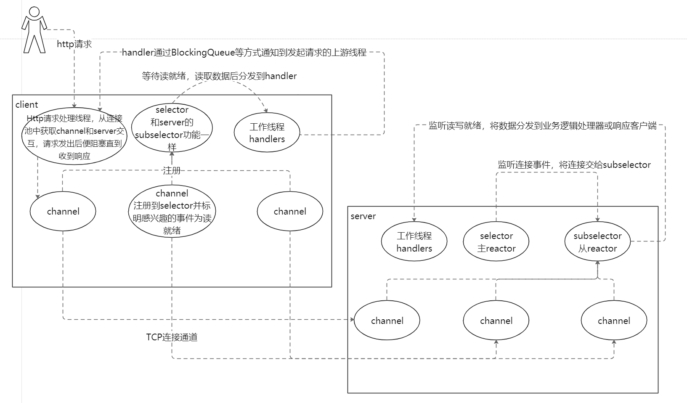

Reactor With NIO
----------------

## NIO

1. 概述：同步非阻塞的I/O模型，I/O多路复用的基础
   * 同步：线程发起一次调用后直到获取到结果才返回
     - IO操作中的同步：API调用返回时调用者就知道结果如何了（实际读取/写入了多少字节）
   * 异步：线程发起一次调用后无论有没有结果，立即返回
     - IO操作中的异步：API调用返回时操作者不知道操作的结果，后面可以通过回调通知结果，也可以不关心结果
   * 阻塞：调用发起后在等待结果的过程中线程挂起
     - IO操作中的阻塞：当无数据可读或不能写入所有数据时，挂起线程
       > 同步阻塞：等待IO数据准备的过程中线程挂起   --传统BIO
         - NIO客户端调用服务端时，对于发起调用的特定线程来说，如果要等待服务端数据响应，那么发起调用的这个线程依然是同步阻塞的  
           但这不属于NIO的概念范围，NIO解决的是IO过程中的阻塞问题，而不能去除业务过程所必须的阻塞等待。
         - 流程简图：
       > 异步阻塞：等待数据准备的通知的过程中线程挂起   --这种情形基本没有
   * 非阻塞：调用发起后在等待结果的过程中线程继续执行其他任务
     - IO操作中的非阻塞：读取时，可以读多少数据就读多少然后返回；写出时，可以写多少就写多少然后返回
       > 同步非阻塞：线程等待IO数据准备的过程中继续执行其他任务，但时不时查询任务状态，如nio的底层机制epoll  --NIO  
       > 异步非阻塞：线程在调用返回后继续执行其他任务 PS:如果有之前调用的通知到达则处理通知，也可能不需要通知或者由其它线程处理通知  --AIO

2. 传统BIO的问题
   * 系统资源的浪费
     > 主要在于大量线程对内存的消耗及线程切换的开销（程序计数器、寄存器的值）：线程是一种昂贵的资源
   * 简单非阻塞IO的问题：任务完成的通知机制问题 --NIO中通过Selector解决
     > 非阻塞模式下，read()方法没读取到数据就会直接返回，但调用方并不知道数据何时会到达，只能不停地调用read()方法进行重试，  
     > 这会造成CPU资源的严重浪费。Selector组件正是为此而生

3. NIO核心组件
   * Channel
     * 描述
       > JDK1.8文档对Channel的描述：
       > A channel represents an open connection to an entity such as a hardware device, a file, a network socket,  
       > or a program component that is capable of performing one or more distinct I/O operations, for example reading or writing.
       > 一个通道代表关联到某个实体的打开的连接，如硬盘、文件、网络套接字，或者能够执行一个或多个IO操作（如读或写）的程序组件。

     * 通道使用起来和BIO的Stream有点像，可以从通道读取数据到buffer中，也可以把buffer中的数据写入通道。区别主要体现在两点：
       > 同一个通道既可以读又可以写，而Stream是单向的只能读或写（InputStream/OutputStream）
       > 通道有非阻塞IO模式

     * 通道是一种很基本的抽象描述，和不同的IO服务交互，执行不同的IO操作，实现不一样
       > FileChannel 读写文件
       > DatagramChannel UDP协议网络通信
       > SocketChannel TCP协议网络通信
       > ServerSocketChannel 服务端监听TCP连接
   * Buffer
     * capacity
     * position
     * limit
   * Selector
     > Selector是一个特殊的组件，用于采集各个通道的状态（即事件）。先将通道注册到selector，设置好关心的事件集，然后就可以通过#select()方法静待事件发生
     > 通道的事件类型：
     > > Accept：有可以接受的连接
     > > Connect：连接成功
     > > Read：读就绪
     > > Write：写就绪
     > Selector解决了前面提到的非阻塞IO不断重试耗费CPU的问题，非阻塞模式下通过Selector，系统线程只为已就绪的通道工作，不用盲目重试了。
     > 当所有通道都没有事件就绪时，eventLoop会在select()处挂起，从而让出CPU资源

4. 简单NIO编程

## Reactor

1. 概念和结构
   > 事件驱动的，有一个或多个并发输入源，有一个ServiceHandler，有多个RequestHandler。这个ServiceHandler会同步的将输入的请求多路复用地  
     分发给RequestHandler。如图：
     
   > 结构上看这有点类似生产者消费者模式，即有一个或多个生产者将事件放入一个Queue中，而一个或多个消费者主动的从这个Queue中Poll事件来处理；  
     不同的是Reactor模式并没有Queue来做缓冲，每当一个Event输入到Service Handler之后，该Service Handler会主动的根据不同的Event类型将其分发给  
     对应的Request Handler来处理。

2. NIO和Reactor
   > 在Java的NIO中，对Reactor模式有无缝的支持，即通过Selector类封装了操作系统提供的Synchronous Event Demultiplexer(同步事件多路复用分发)功能。
   > > PS:这个Doug Lea在Scalable IO In Java中有非常深入的解释，同时这篇文章里也描述了主从分离的Reactor模式，这同样是Netty使用的实现形式

3. 主从分离
   > 问题：单一的Reactor线程不仅负责接收就绪请求，同时还负责从channel读写数据，而读写数据还是需要一定的消耗的，一定程度上回影响吞吐量  
   > 解决方案：主从分离，主reactor只负责接收请求，接收进来后将新的SocketChannel注册到副reactor上，由副reactor进行后续的读写操作和业务分发到Handler

4. 优缺点
   * 优点
     > 解耦、提升复用性、模块化、可移植性、事件驱动、细力度的并发控制等
   * 缺点
     > 相比传统的简单模型，Reactor增加了一定的复杂性，因而有一定的门槛，并且不易于调试  
     > Reactor模式需要底层的Synchronous Event Demultiplexer支持，比如Java中的Selector支持，操作系统的select系统调用支持，  
       如果要自己实现Synchronous Event Demultiplexer可能不会有那么高效。 --所以在直接借用Selector的情况下这一点也不重要  
     > Reactor模式在IO读写数据时还是在同一个线程中实现的，即使使用多个Reactor机制（即主从分离）的情况下，那些共享一个Reactor的Channel如果出现  
       一个长时间的数据读写，还是会影响这个Reactor中其他Channel的相应时间，比如在大文件传输时，IO操作就会影响其他Client的相应时间，因而  
       对这种操作，使用传统的Thread-Per-Connection或许是一个更好的选择，或者此时使用Proactor模式。

## Netty

